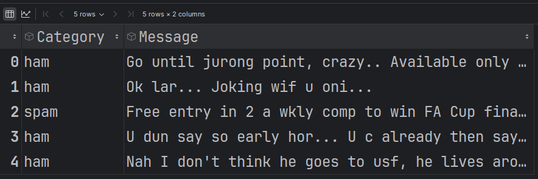
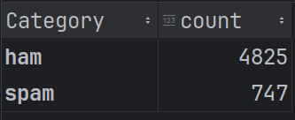
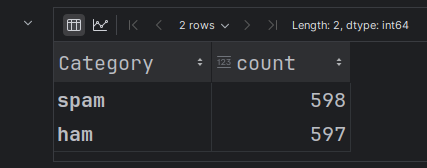

# How to classify text using spaCy

In this tutorial we are going to use [Spam Text Message Classification](https://www.kaggle.com/datasets/team-ai/spam-text-message-classification) from `kaggle`

let's download the dataset and first do some analsis on data

Firts check label balance !
```python
import pandas as pd

# Load CSV file
df = pd.read_csv('SPAM_text_message_20170820_Data.csv')
df.head()
```
This is a 2 column file  



---

Let's check how many unique labels we have and what are their respective counts
```python
# Get unique values and their counts in the "Category" column
category_counts = df['Category'].value_counts()
```



We can see significant imbalance between `ham` and `spam` class


Let's split data into test and train set, for simplicity and mitigate the effect of label imbalance

use all datapoints for spam class but only use randomly shuffled limited number of data points from ham class

create spam dataframe with 747 rows
create ham dataframe with 747 rows (remember random shuffling)


From the balanced data frame create 2 dataframes train and test
```python
from sklearn.model_selection import train_test_split

# Filter the rows with "spam"
spam_df = df[df['Category'] == 'spam']

# Randomly select 747 rows with "ham"
ham_df = df[df['Category'] == 'ham'].sample(n=747)

# Combine the two dataframes
balanced_df = pd.concat([spam_df, ham_df])

# Optionally, shuffle the combined dataframe
balanced_df = balanced_df.sample(frac=1).reset_index(drop=True)

# Display the result
balanced_df.head(5)

# Split the balanced dataset into training and testing sets (80/20 ratio)
balanced_train_df, balanced_test_df = train_test_split(balanced_df, test_size=0.2, random_state=42, stratify=balanced_df['Category'])

```

---

### What stratify do in above code?

The `stratify` parameter in `train_test_split` ensures that the proportion of classes (in your case, "ham" and "spam") is maintained in both the training and testing sets. This means that the split will have the same distribution of categories as the original dataset.

### Without `stratify`:
If you don't use `stratify`, the split is done randomly, which might result in an imbalanced distribution of classes in the training and testing sets. For example, you could end up with more "ham" or "spam" instances in one set compared to the other.

### With `stratify`:
When you set `stratify=balanced_df['Category']`, it ensures that both the training and testing sets will have the same proportion of "ham" and "spam" as in the original `balanced_df`. This is particularly important when dealing with imbalanced datasets or when the distribution of classes is crucial for the model's performance.

For example, if your `balanced_df` has a 50/50 distribution of "ham" and "spam," using `stratify` ensures that both the training and testing sets will also have a 50/50 distribution.
---

Now verify what's the category distribution in train dataset
```python
balanced_category_count = balanced_train_df['Category'].value_counts()
balanced_category_count
```
Output:  


---

### Let's arrange train data in a format spaCy can accept
```python
import spacy
from spacy.training import Example

# Initialize spacy's English model
nlp = spacy.blank('en')

# Add the text classifier to the pipeline
if 'textcat' not in nlp.pipe_names:
    textcat = nlp.add_pipe('textcat', last=True)

# Add your labels to the text classifier
for label in balanced_train_df['Category'].unique():  # Replace with your actual label column name
    textcat.add_label(label)

# Create training data
train_data = []
for text, label in zip(balanced_train_df['Message'], balanced_train_df['Category']):  # Replace with your actual column names
    doc = nlp.make_doc(text)
    example = Example.from_dict(doc, {"cats": {label: 1.0}})
    train_data.append(example)
```

---

### let's do spaCy training for 10 epochs
```python
import random

# Initialize the training process
optimizer = nlp.begin_training()

# Set the number of training iterations (epochs)
n_iter = 10

# Training loop
for i in range(n_iter):
    losses = {}
    random.shuffle(train_data)
    batches = spacy.util.minibatch(train_data, size=spacy.util.compounding(4.0, 32.0, 1.001))
    for batch in batches:
        nlp.update(batch, sgd=optimizer, losses=losses)
    print(f"Epoch {i + 1}: Losses {losses}")

# Save the trained model to disk
nlp.to_disk('text_classifier_model')

```

Output:  
```bash
Epoch 1: Losses {'textcat': 17.627797796547693}
Epoch 2: Losses {'textcat': 1.693402770760869}
Epoch 3: Losses {'textcat': 0.29480036633374296}
Epoch 4: Losses {'textcat': 0.2008683757211756}
Epoch 5: Losses {'textcat': 4.3413760062642557e-07}
Epoch 6: Losses {'textcat': 8.53025894304916e-08}
Epoch 7: Losses {'textcat': 5.673169704225754e-08}
Epoch 8: Losses {'textcat': 3.913132671566036e-08}
Epoch 9: Losses {'textcat': 2.72724149418869e-08}
Epoch 10: Losses {'textcat': 1.8967485559276214e-08}
```

---


### Let's check accuracy on test data
```python
import spacy
from sklearn.metrics import accuracy_score

# Load the saved model from disk
nlp = spacy.load('text_classifier_model')

# Prepare the test data
texts = balanced_test_df['Message'].tolist()  # Replace with your actual column name
true_labels = balanced_test_df['Category'].tolist()  # Replace with your actual column name

# Predict labels for the test data
predicted_labels = []
for text in texts:
    doc = nlp(text)
    # Get the scores for each category
    scores = doc.cats
    # Find the category with the highest score
    predicted_label = max(scores, key=scores.get)
    predicted_labels.append(predicted_label)
    # print(text)
    # print(predicted_label)
    # print("--------------------------------------")

# Calculate the accuracy
accuracy = accuracy_score(true_labels, predicted_labels)
print(f"Accuracy on the test set: {accuracy:.4f}")

```

Output:
```bash
Accuracy on the test set: 0.9833
```

---

### Let's randomly select some datapoint from test dataset and check its prediction by running this code multiple times

```python
import spacy
import random

# Load the saved model from disk
nlp = spacy.load('text_classifier_model')

# Randomly pick one row from the test dataset
random_index = random.randint(0, len(balanced_test_df) - 1)
random_text = balanced_test_df.iloc[random_index]['Message']  # Replace with your actual column name
true_label = balanced_test_df.iloc[random_index]['Category']  # Replace with your actual column name

# Make a prediction on the randomly selected text
doc = nlp(random_text)
scores = doc.cats
predicted_label = max(scores, key=scores.get)

# Output the results
print(f"Randomly selected text: {random_text}")
print(f"True Label: {true_label}")
print(f"Predicted Label: {predicted_label}")
print(f"Scores: {scores}")


```

Output:
```text
Randomly selected text: URGENT! Your Mobile number has been awarded with a £2000 prize GUARANTEED. Call 09061790126 from land line. Claim 3030. Valid 12hrs only 150ppm
True Label: spam
Predicted Label: spam
Scores: {'spam': 0.9999997615814209, 'ham': 2.096758748848515e-07}

```